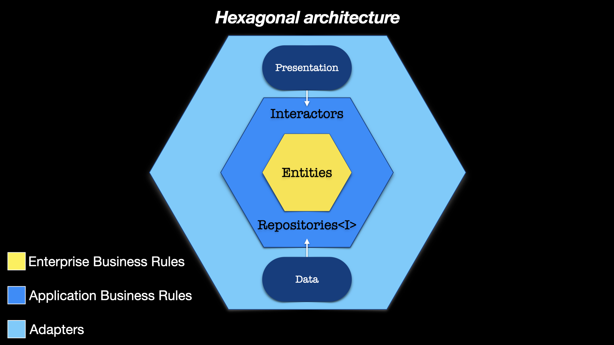
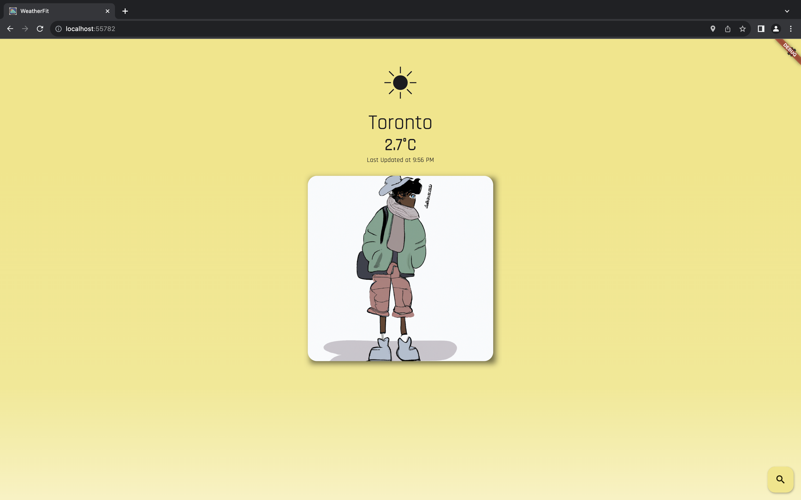
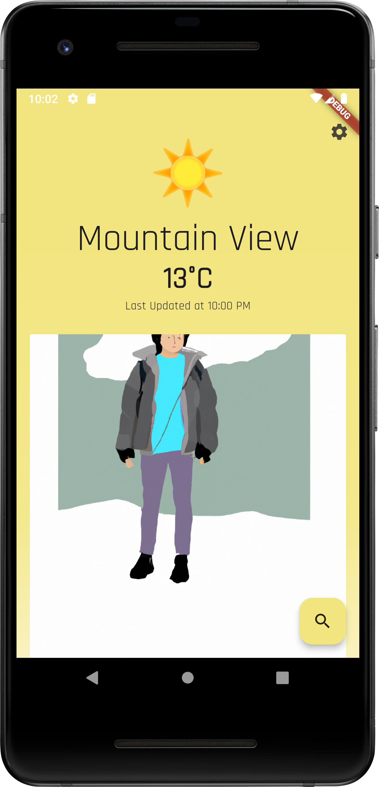
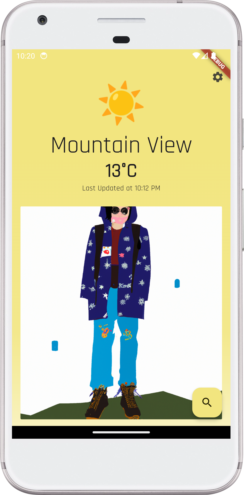
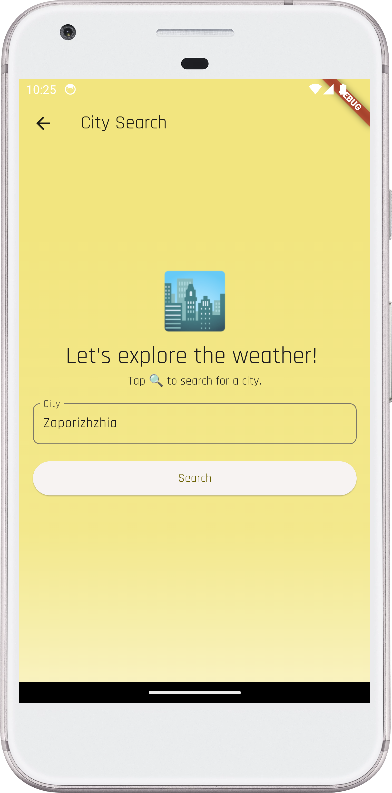
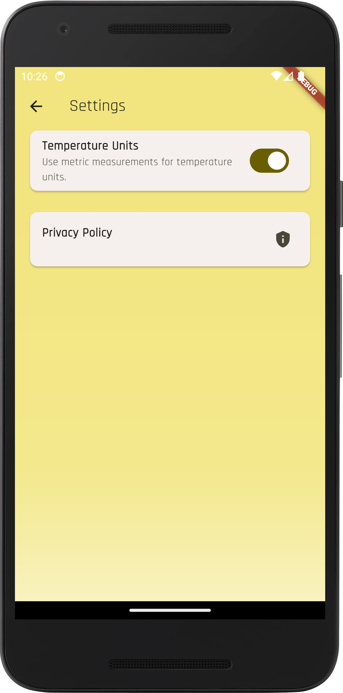
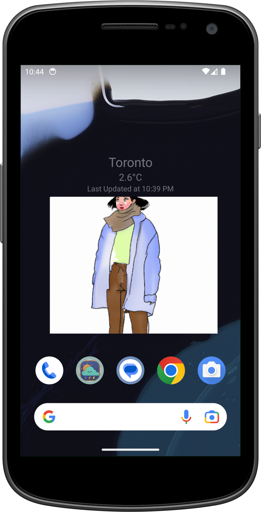

[](https://stand-with-ukraine.pp.ua)
[](https://appdistribution.firebase.dev/i/350faded06826d7b)
[](https://weather-fit-ai.web.app)
[](https://github.com/flutter/flutter/wiki/Style-guide-for-Flutter-repo)
[](https://pub.dev/packages/flutter_lints)
[](https://codecov.io/gh/Turskyi/weather_fit)
[](https://play.google.com/store/apps/details?id=com.turskyi.weather_fit)


# Weather Fit

**WeatherFit** is more than just a weather app, it’s a personal stylist that
helps you dress well and stay comfortable. Whether you’re going to work,
school, or a party, _WeatherFit_ will show you the best outfit for any weather
condition. Enter your location or use GPS, and **WeatherFit** will display
the current weather and a full-height image of a person wearing a suitable
outfit. You can customize the image according to your preferences
(in development!), such as age, gender, skin tone, hair color, etc. This way,
the image will be more personalized and relevant to you. You can also see the
forecast for the next few days and get outfit recommendations for each day. You
can choose from different styles and categories of outfits, such as casual,
formal, sporty, etc. **WeatherFit** will also give you tips and advice on how
to accessorize and layer your clothes. WeatherFit is your smart and stylish
weather companion. Download it now and never worry about what to wear again.
🌤️👕👖👞

## PROJECT SPECIFICATION

• Programming language: [Dart](https://dart.dev/);

• SDK: [Flutter](https://flutter.dev/);

• Interface: [Flutter](https://flutter.dev/docs/development/ui);

• Version control system: [Git](https://git-scm.com);

• Git Hosting Service: [GitHub](https://github.com);

• RESTful API: [Free Weather API](https://open-meteo.com);

• CI/CD: [GitHub Actions](https://docs.github.com/en/actions) is used to deliver
new Android Package (APK) to
[Firebase App Distribution](https://firebase.google.com/docs/app-distribution)
after every push to any other than the **master**branch,
[Codemagic](https://codemagic.io/start/) is used to deliver new release app
bundle to **Google Play** after every merge (push) to **master** branch;

• State management approach: [BLoC](https://bloclibrary.dev);

• App testing platforms:
[Firebase App Distribution](https://firebase.google.com/docs/app-distribution);

**Code Readability:** code is easily readable with no unnecessary blank lines,
no unused variables or methods, and no commented-out code, all variables,
methods, and resource IDs are descriptively named such that another developer
reading the code can easily understand their function.

## Getting Started

**Weather Fit** is an open source project and welcomes contributions from
anyone who is interested. If you want to contribute to Weather Fit, you can
follow these steps:

- Fork this repository and clone it to your local machine.
- Create a new branch for your feature or bug-fix.
- Make your changes and commit them with a clear and descriptive message.
- Push your branch to your forked repository and create a pull request to the
  master brunch.
- Wait for your pull request to be reviewed and merged.

Please follow
[the Flutter style guide](https://github.com/flutter/flutter/wiki/Style-guide-for-Flutter-repo)
and code of conduct when contributing to **Weather Fit**. You can also use
the issues and discussions tabs to report bugs, request features, or give
feedback.

### Running the App on Web

To see an image generated by AI in debug mode when running the app on the web,
you should run the app with the following command to avoid CORS issues:

```bash
flutter run -d chrome --web-browser-flag --disable-web-security
```

Otherwise, you might encounter CORS issues and the image will not be displayed.

## Installation

To install **Weather Fit**, you need to have Flutter SDK and Android Studio
installed on your machine. You can follow
[the official documentation](https://docs.flutter.dev/get-started/install) to
set up your development environment. To run a **Weather Fit** on your
device or emulator, you need to clone this repository and open it in Android
Studio. Then, you can use the run button or the command line to launch the app.
For more information, see the Flutter documentation.

## To create generated files, run:

```
dart run build_runner clean
dart run build_runner build --delete-conflicting-outputs
```

## Test Coverage

Run tests, generate a code coverage report, and view that report in a web
browser. This can be useful for checking which parts of the code are covered by
tests and which parts might need more testing. Please note that you need to
have `lcov` and `genhtml` installed on your system to use these commands. If
they are not installed, you can usually install them with a package manager
like `apt` or `brew`.

```bash
flutter test --coverage
genhtml coverage/lcov.info -o coverage
open coverage/index.html
```

<details style="border: 1px solid #aaa; border-radius: 4px; padding: 0.5em 0.5em 0;">
  <summary style="font-weight: bold; margin: -0.5em -0.5em 0; padding: 0.5em; border-bottom: 1px solid #aaa;">Architectural pattern:

[Hexagonal architecture](https://alistair.cockburn.us/hexagonal-architecture/)

  </summary>
<a href="https://alistair.cockburn.us/hexagonal-architecture/">
<!--suppress CheckImageSize -->

</a>

## Layers

### Application/Core - `core`

The Application (core) is the heart of the architecture.
It houses the business logic and domain objects, which are the kernel of value
in the software.
This core of the application should be designed as a set of interfaces or ports
that define the behavior of the system, without any implementation details.
It is independent of external systems and concerns.
The core of the application is designed to work without either a UI or a
database.
This allows the application to be driven by users, programs, automated tests,
or batch scripts, and to be developed and tested in isolation from its eventual
run-time devices and databases.
The application core remains detached from external influences, thus preserving
the integrity of the business logic and the domain model.

#### Enterprise Business Rules - `entities`

An **Entity** is an object within our computer system that embodies a small set
of critical business rules operating on Critical Business Data.
Entities are a way to implement and enforce application-independent business
rules.

#### Interactors - `interactors`

The `interactors` module defines the business logic of the app.
It is a part that is independent of the development platform, in other words,
it is written purely in the programming language and doesn't contain any
elements from the platform.
In the case of `Flutter`, `interactors` would be written purely in `Dart`
without any `Flutter` elements.
The reason for that is that `interactors` should only be concerned with the
business logic of the app, not with the implementation details.

#### Adapters - `adapters`

`adapters` is the layer outside Application Business Rules.
`Adapters` crosses the boundaries of the layers to communicate with
`Application Business Rules`, however, the **Dependency Rule** is never
violated.
Using `polymorphism`, `Adapters` communicates with `Application Business Rules`
using inherited classes: classes that implement or
extend the `Interactor`s presented in the `Application Business Rules` layer.
Since `polymorphism` is used, the `Repositories` passed to `Adapters` still
adhere to the **Dependency Rule** since as far as `Adapters` is concerned, they
are abstract.
The implementation is hidden behind the `polymorphism`.

</details>

<details style="border: 1px solid #aaa; border-radius: 4px; padding: 0.5em 0.5em 0;">
  <summary style="font-weight: bold; margin: -0.5em -0.5em 0; padding: 0.5em; border-bottom: 1px solid #aaa;">Style guides:

[Style guide for Flutter](https://github.com/flutter/flutter/wiki/Style-guide-for-Flutter-repo),
[Dart style guide](https://dart.dev/effective-dart).

  </summary>

- [DO use trailing commas for all function calls and declarations unless the function call or definition, from the start of the function name up to the closing parenthesis, fits in a single line.](https://dart-lang.github.io/linter/lints/require_trailing_commas.html)

- [DON'T cast a nullable value to a non-nullable type. This hides a null check and most of the time it is not what is expected.](https://dart-lang.github.io/linter/lints/avoid_as.html)

- [PREFER using `const` for instantiating constant constructors](https://dart-lang.github.io/linter/lints/prefer_const_constructors.html)

If a constructor can be invoked as const to produce a canonicalized instance,
it's preferable to do so.

- [DO sort constructor declarations before other members](https://dart-lang.github.io/linter/lints/sort_constructors_first.html)

- ### Avoid Mental Mapping

A single-letter name is a poor choice; it’s just a placeholder that the reader
must mentally map to the actual concept. There can be no worse reason for using
the name `c` than because `a` and `b` were already taken.

- ### Method names

Methods should have verb or verb phrase names like `postPayment`, `deletePage`,
or `save`. Accessors, mutators, and predicates should be named for their value
and prefixed with `get`…, `set`…, and `is`….

- ### Use Intention-Revealing Names

If a name requires a comment, then the name does not reveal its intent.

- ### Use Pronounceable Names

If you can’t pronounce it, you can’t discuss it without sounding like an idiot.

- ### Class Names

Classes and objects should have noun or noun phrase names and not include
indistinct noise words:

```
GOOD:
Customer, WikiPage, Account, AddressParser.

BAD:
Manager, Processor, Data, Info.
```

- ### Functions should be small

Functions should hardly ever be 20 lines long.
Blocks within if statements, else statements, while statements, and so on
should be **_one_** line long. Probably that line should be a function call.

- ### Functions should do one thing

To know that a function is doing more than “one thing” is if you can extract
another function from it with a name that is not merely a restatement of its
implementation.

- ### One Level of Abstraction per Function

We want the code to read like a top-down narrative. We want every function to
be followed by those at the next level of abstraction so that we can read the
program, descending one level of abstraction at a time as we read down the list
of functions.

- ### Dependent Functions

If one function calls another, they should be vertically close, and the caller
should be **_above_** the callee, if possible.

- ### Use Descriptive Names

Don’t be afraid to make a name long. A long descriptive name is better than a
short enigmatic name. A long descriptive name is better than a long descriptive
comment.

- ### Function Arguments

The ideal number of arguments for a function is zero (niladic). Next comes one
(monadic), followed closely by two (dyadic). Three arguments (triadic) should
be avoided where possible.

```
GOOD:
includeSetupPage()

BAD:
includeSetupPageInto(newPageContent)
```

- ### Flag Arguments

Flag arguments are ugly. Passing a boolean into a function is a truly terrible
practice. It immediately complicates the signature of the method, loudly
proclaiming that this function does more than one thing. It does one thing if
the flag is true and another if the flag is false!

```
GOOD:
renderForSuite()
renderForSingleTest()

BAD:
render(bool isSuite)
```

- ### Explain Yourself in Code

Only the code can truly tell you what it does. Comments are, at best, a
necessary evil. Rather than spend your time writing the comments that explain
the mess you’ve made, spend it cleaning that mess. Inaccurate comments are far
worse than no comments at all.

```
BAD:
// Check to see if the employee is eligible
// for full benefits
if ((employee.flags & hourlyFlag) && (employee.age > 65))

GOOD:
if (employee.isEligibleForFullBenefits())

```

- ### TODO Comments

Nowadays, good IDEs provide special gestures and features to locate all the
`//TODO` comments, so it’s not likely that they will get lost.

- ### Public APIs

There is nothing quite so helpful and satisfying as a well-described public API.
It would be challenging, at best, to write programs without them.

```dart
/// dart doc comment
```

- ### Commented-Out Code

We’ve had good source code control systems for a very long time now. Those
systems will remember the code for us. We don’t have to comment it out anymore.

- ### Position Markers

In general, they are the clutter that should be eliminated—especially the noisy
train of slashes at the end. If you overuse banners, they’ll fall into the
background noise and be ignored.

```dart
// Actions //////////////////////////////////
```

- ### Don’t Return Null

When we return `null`, we are essentially creating work for ourselves and
foisting problems upon our callers. All it takes is one missing `null` check to
send an app spinning out of control.

- ### Don’t Pass Null

In most programming languages, there is no **GOOD** way to deal with a `null`
that is passed by a caller accidentally. Because this is the case, the rational
approach is to forbid passing null by default. When you do, you can code with
the knowledge that a `null` in an argument list is an indication of a problem,
and end up with far fewer careless mistakes.

- ### Classes Should Be Small!

With functions, we measured size by counting physical lines. With classes, we
use a different measure. **We count responsibilities.** The Single
Responsibility Principle (SRP) states that a class or module should have one,
and only one, reason to change. The name of a class should describe what
responsibilities it fulfills. The more ambiguous the class name, the more
likely it has too many responsibilities. The problem is that too many of us
think that we are done once the program works. We move on to the next problem
rather than going back and breaking the overstuffed classes into decoupled
units with single responsibilities.

- ### Artificial Coupling

In general, an artificial coupling is a coupling between two modules that
serves no direct purpose. It is a result of putting a variable, constant, or
function in a temporarily convenient, though inappropriate, location. For
example, general `enum`s should not be contained within more specific classes
because this forces the app to know about these more specific classes. The same
goes for general purpose `static` functions being declared in specific classes.

- ### Prefer Polymorphism to If/Else or Switch/Case

There may be no more than one switch statement for a given type of selection.
The cases in that switch statement must create polymorphic objects that take
the place of other such switch statements in the rest of the system.

- ### Replace Magic Numbers with Named Constants

In general, it is a bad idea to have raw numbers in your code. You should hide
them behind well-named constants. The term “Magic Number” does not apply only
to numbers. It applies to any token that has a value that is not
self-describing.

- ## Encapsulate Conditionals

Boolean logic is hard enough to understand without having to see it in the
context of an `if` or `while` statement. Extract functions that explain the
intent of the conditional.

```
GOOD:
if (shouldBeDeleted(timer))

BAD:
if (timer.hasExpired() && !timer.isRecurrent())
```

- ### Avoid Negative Conditionals

Negatives are just a bit harder to understand than positives. So, when
possible, conditionals should be expressed as positives.

```
GOOD:
if (buffer.shouldCompact())

BAD:
if (!buffer.shouldNotCompact())
```

- ### Encapsulate Boundary Conditions

Boundary conditions are hard to keep track of. Put the processing for them in
one place.

```
BAD:
if (level + 1 < tags.length) {
  parts = Parse(body, tags, level + 1, offset + endTag);
  body = null;
}

GOOD:
int nextLevel = level + 1;
if (nextLevel < tags.length) {
  parts = Parse(body, tags, nextLevel, offset + endTag);
  body = null;
}
```

- ### Constants versus Enums

Don’t keep using the old trick of public `static` `final` `int`s. `enum`s can
have methods and fields. This makes them very powerful tools that allow much
more expression and flexibility.

</details>

• Screenshots:

<!--suppress CheckImageSize -->

<!--suppress CheckImageSize -->

<!--suppress CheckImageSize -->

<!--suppress CheckImageSize -->

<!--suppress CheckImageSize -->

<!--suppress CheckImageSize -->

<!--suppress CheckImageSize -->


## Download

<a href="https://play.google.com/store/apps/details?id=com.turskyi.weather_fit" target="_blank">

</a>

## Credits

This project is based on the
[Flutter Weather Tutorial](https://bloclibrary.dev/tutorials/flutter-weather/)
by [the Bloc Community](https://github.com/felangel/bloc/graphs/contributors).
